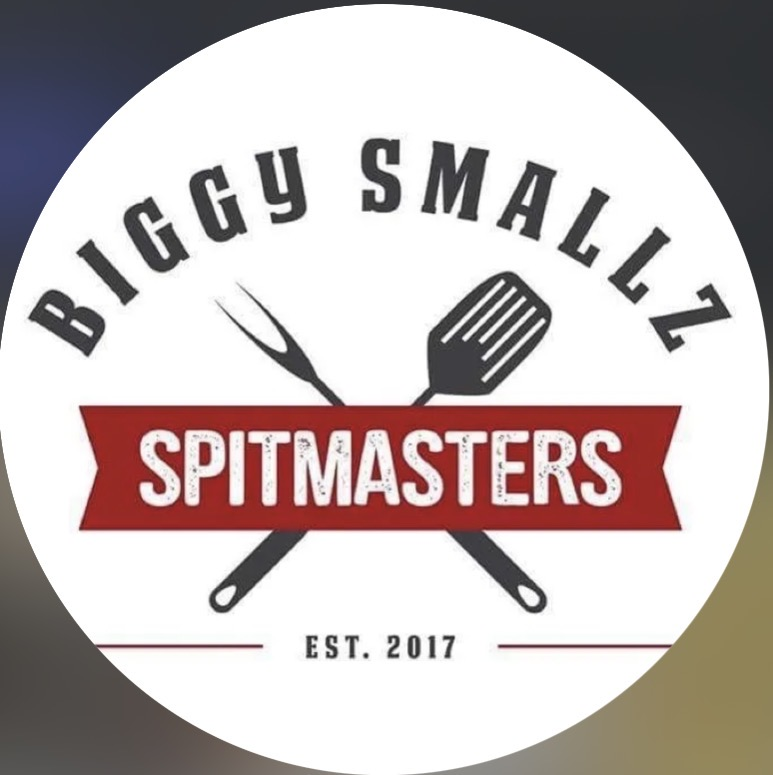

# Biggy Smallz Spitmasters — Stage 6: Visual identity

*Mark · 2026-09-23 · checkpoint 1 (direction) answered 2026-09-23 · checkpoint 2 (build) below · **approved by TK 2026-09-24***

## Why this stage stops halfway

Stage 6 ends with a locked palette, type and mark, plus the full `brand-identity/` folder (`Machine/deliverable-spec.md`). The last identity failed at exactly this point. The commit that retired it reads: *"Drop the mark-routes exploration — never referenced the real logo"* (`0737f7f`). So this stage runs in two checkpoints:

1. **Direction (this file):** what already exists, the tests run on it, and the decisions that only TK and Martin can make.
2. **Build:** once the direction is locked, the folder gets built: svg, png, social, favicon, the guide, and the five mandatory tests on the new artwork.

The stage isn't done, and isn't marked approved, until checkpoint 2.

---

## 1. What already exists: Martin's logo, since 2017

**Elements:** "BIGGY SMALLZ" arched over the top · a braai fork and a grill spatula crossed · a red ribbon reading "SPITMASTERS" · "EST. 2017" between two rules.

**Where it already lives:**
- **Embroidered on his chef jacket.** You can see it in the site's hero photo, where he's carving the lamb (`public/images/home-hero.png`).
- The Instagram avatar.
- The site header and footer (`public/logo.png`).

This is real equity. It's been worn on camera and at the Mozambique festival.

**Colours, sampled from the logo file (median of pixels):**

| | Hex |
|---|---|
| Red (ribbon) | `#952926` |
| Charcoal (type, tools) | `#3F3F41` |
| White (ground) | `#FFFFFF` |

**What files exist:** raster only.
- `logo.png` is 1600×1183 with white type on transparent, for dark grounds only.
- `logo-spitmasters-badge-original.png` is 773×775, a capture of the Instagram avatar with blurred corners.
- **There's no vector file** and no version with dark type for light grounds. The distressed speckle texture is baked into "SPITMASTERS".

## 2. Tests run on the current logo

Evidence images: `06-evidence/reduction-current-logo.png`, `06-evidence/circle-crop-current-logo.png`.

| Test | Result |
|---|---|
| **Reduction** (150 → 16 px) | The whole badge reads down to about **48px**. At 32px and below, "BIGGY SMALLZ", "EST. 2017" and the rules disappear. **What survives is the red ribbon crossed by the tools.** |
| **Wide logo on white** | The white "BIGGY SMALLZ" and "EST. 2017" **disappear completely**. There's no version for a light ground. |
| **Circle crop** (320 → 28 px) | The name is unreadable at **56px and below**. At 40 and 28px (a WhatsApp contact list) it's a red bar and an X. |
| **Contrast** (WCAG, computed) | White on red **8.01:1** ✓ · charcoal on white **10.51:1** ✓ · red on white **8.01:1** ✓ · **red on black 2.27:1 ✗** · **red on charcoal 1.31:1 ✗**. Red can't be used as text on a dark ground. The ribbon works only because it carries white type. |
| **Production** | The speckle texture prints as noise and will break up in embroidery or screen print. The fork tines are the thinnest detail and get measured against the ~1.5% floor when the logo is redrawn. There's no single-ink file. |

**Reading:** nothing here says the design is wrong. Everything that fails is the *files*: no vector, no light-ground version, baked-in texture, and no small cut. The small cut is already in the logo. It's the part that survives: the ribbon and the crossed tools.

## 3. The decision: what happens to the logo — `[TK + MARTIN TO DECIDE]`

### Route 1: redraw it faithfully ← **recommended**
The same composition, redrawn as clean vector:
- the texture is removed, or kept only as an optional print effect
- all the colourways the spec needs, including dark type for light grounds and a single-ink version
- a **small cut** (the ribbon and crossed tools) for 40px and below: the favicon, the WhatsApp avatar, a stamp on a menu.

**For:**
- The jacket, the avatar, the TV-era photos and the festival photos all stay consistent.
- It's his mark, the same way Stage 3's position is in his words.
- The last attempt failed by ignoring it.

**Against:** the least "new" feeling of the three. If Martin wants a visible change, this won't give him one.

### Route 2: evolve it
Keep every element (arched name, ribbon, "EST. 2017", crossed tools), but redraw the type and proportions so the name survives smaller. The arch is what dies first.

One real question to put to Martin: **the tools are a braai fork and a grill spatula, not a spit.** He's known for the spitbraai (01 §4), and the name says Spitmasters. An evolution could swap one tool for a spit rod.

**For:** more room to fix the small sizes, and the mark could say "spit" as well.
**Against:** the embroidered jackets and existing photos would no longer match exactly.

### Route 3: replace it
A new mark. **Not recommended:**
- The logo is on his uniform and in years of photos.
- The position is about *him*.
- Replacing the mark he's worn since 2017 is the failure that restarted this engagement.

## 4. Palette proposal: from the logo, not from the current site

The site's current palette (ember and gold, with Cinzel and EB Garamond) was a studio choice made on 2026-08-22, outside the method. It isn't Martin's. The proposal starts from his logo:

| Name (working) | Hex | Source |
|---|---|---|
| Spitmasters Red | `#952926` | sampled from the logo |
| Charcoal | `#3F3F41` | sampled from the logo |
| White | `#FFFFFF` | the logo's ground |
| Jacket Black | `#161517` | **proposed**: the dark ground, after his black chef jacket. Not sampled, because the photo's colour grade makes it unreliable |
| Bone | `#F4EFE6` | **proposed**: a warm paper for plated menus and proposals, the "quiet" ground |

**Every pairing, computed (WCAG):**

| Pair | Ratio | Use |
|---|---|---|
| Jacket Black / White | 18.2 | ✓ text |
| Jacket Black / Bone | 15.89 | ✓ text |
| Charcoal / White | 10.51 | ✓ text |
| Charcoal / Bone | 9.17 | ✓ text |
| Red / White | 8.01 | ✓ text, both ways |
| Red / Bone | 6.99 | ✓ text, both ways |
| Red / Jacket Black | 2.27 | ✗ graphics only, never text |
| Charcoal / Jacket Black | 1.73 | ✗ never together |
| Red / Charcoal | 1.31 | ✗ never together |

## 5. Type: shortlist, locked at checkpoint 2

The logo already has two voices: arched slab capitals ("BIGGY SMALLZ") and a condensed bold sans ("SPITMASTERS"). The original fonts **aren't identified**, and I won't guess them. The voice guide asks for *loud about the eating, quiet about the care* (05), so the brand needs one loud face and one quiet one:

- **Loud (display):** a condensed bold sans in the family of "SPITMASTERS". Candidates, all on Google Fonts so they fit the studio pipeline: **Oswald**, **Bebas Neue**, **Anton**.
- **Quiet (text):** a calm, readable face for menus, proposals and the site body. Candidates: **Source Serif 4**, **Lora**.

These get locked once the mark route is chosen, because the display face has to sit beside the redrawn ribbon.

---

### Gate at checkpoint 1
| Check | Result |
|---|---|
| Direction starts from the client's real material | ✓ his 2017 logo, his jacket, his photos |
| Tests run on the existing mark, with evidence images saved | ✓ reduction, circle crop, contrast (9 pairs computed), production notes |
| Every colour either sampled or marked "proposed" | ✓ 3 sampled, 2 proposed |
| Nothing is presented as locked that TK hasn't chosen | ✓ |
| The five mandatory tests on the new artwork | pending: checkpoint 2 |

---

# Checkpoint 2: build · 2026-09-23 · **approved by TK 2026-09-24**

> **TK's answers:**
> - Accept the thin details as they are, for embroidery.
> - The fonts are fine.
> - The printer's line floor is still open ("I'll let you know").
> - Commit.

**Decisions from checkpoint 1 (TK, 2026-09-23):**
- **Route 1**, redraw faithfully.
- **No spit in the logo** (Martin), but TK asked for one to look at.
- **No source files exist.**
- **The palette is approved.**

**Delivered:** `brand-identity/`, built to `Machine/deliverable-spec.md`. The client opens `brand-identity/README.md` first, then `brand-guide.html`.

## What was built
- **svg/:**
  - 5 cuts × 3 colourways = 15 files: `lockup`, `mark`, `mark-small`, `wordmark` and `wordmark-wide`, each as `-charcoal`, `-white` and `-single`.
  - All fills, no strokes, viewBox from 0 0, tight bounds, one path per colour, with a comment header.
  - `_working/` explains why no live-text copies exist: the lettering is Martin's, traced, not set in a font.
- **png/:** 30 files. Every cut in charcoal and white at 512, 1024 and 2048px, transparent. There's no PNG of `-single`, and the README says why.
- **social/:** four 1080×1080 profile pictures (badge and mark, each on white and on Jacket Black), plus `_circle-crop-check.png`.
- **favicon/:** 16, 32 and 48px, each rendered natively, plus the 180px Apple icon, `.ico`, and a `.svg` with its own white field. The favicon cut is cropped square around the tools, because the whole cut fitted into a square left the ribbon a 3px line at 16px.
- **brand-guide.html:** one file, about 490KB. Fonts are subset and embedded, and every mark is inline SVG. The last render made 0 network requests and shows no horizontal scroll at 400px.
- **bios.md:** generated from `brand/_build/bios.py`.
- **README.md:** which file to use for which job, how to rebuild, and dated decisions.
- **_build/:** the source raster, traced layers, fonts (OFL), scripts and tests.
- **Type:** **Oswald** for headlines, the closest of the shortlist to the ribbon lettering. **Source Serif 4** for text. Approved by TK, 2026-09-24.

## How faithful it is
The redraw's silhouette overlaps the 2017 logo's by **98.3%**. The difference is the speckle texture (removed), the fork's needle tips (blunted 6px), and anti-aliased edges. The wordmarks use his own arched letters, straightened. They aren't a substitute font.

## The spit version (exploration, for TK only)
`brand/06-evidence/spit-variant-EXPLORATION/`: the grill spatula is swapped for a spit rod with a crank and a spit fork. It's **not part of the identity**, because Martin said no. Seen next to the real one, the spit reads thinner and busier than the spatula, and the crank crowds the lower edge.

---

### Gate: the five mandatory tests, plus the reproducible build
| Test | Result |
|---|---|
| **Reduction** (150→16px, 5 cuts × 3 grounds) | ✓ The minimums are set from it: badge 80px, mark 48px, wordmark 80px, wide wordmark 150px. The favicon cut is for 16–32px only. |
| **Circle crop** (320/120/56/40/28px, light and dark UI) | ✓ The badge's name goes below 56px, which is expected and recorded. The mark holds at 40–56px, so **use the mark for WhatsApp** and the badge for Instagram. |
| **Contrast** (all 10 pairings computed) | ✓ The rules are written from the numbers. 4 pairings fail as text: Spitmasters Red/Charcoal 1.31, Spitmasters Red/Jacket Black 2.27, Charcoal/Jacket Black 1.73, White/Bone 1.15. Red is never text on a dark ground. |
| **Production minimums** | ✓ Single ink is proven black on white (`_build/tests/single-ink-*.png`). Minimum sizes are given in px and mm (print assumes a 0.2mm finest line, `[confirm with printer]`). **✗ Embroidery:** the fork's tines and EST. 2017 are under the 1.5%-of-width guideline (5th-percentile detail: badge 0.49%, mark 0.83%). **Not fixed**, because thickening them changes his mark (a 20px blunting erased the tines). It's recorded in the guide and README. **Accepted as-is by TK, 2026-09-24.** |
| **The guide demonstrates its own claims** | ✓ Clear space x is 172 units, and the lettering measures 171.9 in the SVG. The contrast claims match `contrast.json`. The minimum sizes come from the same numbers as the reduction rows. "Nothing else changed" is backed by the 98.3% overlap. |
| **Reproducible build** | ✓ Two clean builds gave **93 files, byte-identical**. |
